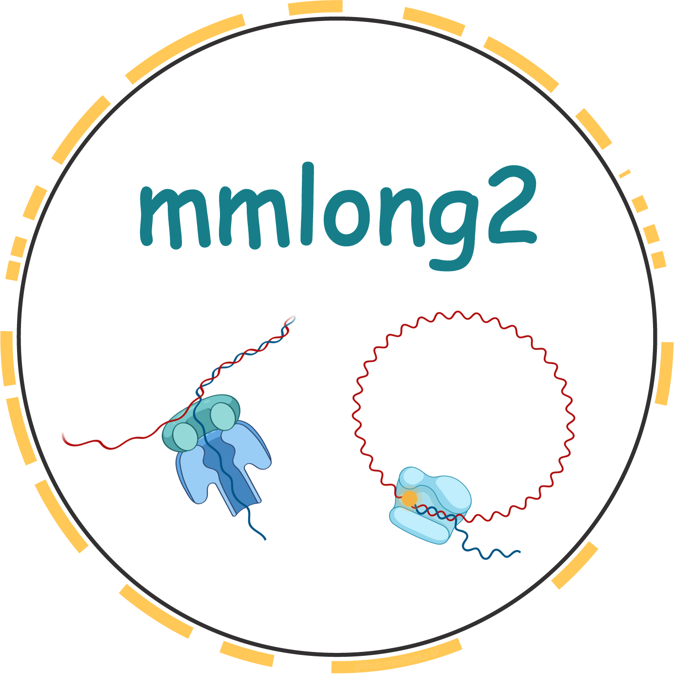
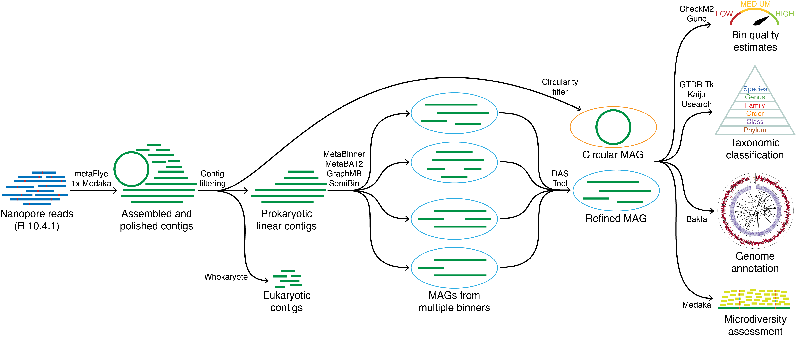

[](https://github.com/Serka-M/mmlong2/blob/main/LICENSE)


<p align="center">

</p>

Automated long-read metagenomics workflow, using either PacBio HiFi or Nanopore sequencing reads as input to generate characterized MAGs.
The mmlong2 workflow is a continuation of [mmlong](https://github.com/SorenKarst/mmlong).

**Note:** At the moment, mmlong2 is an in-house pipeline at Aalborg University Bioservers. A distributable version of the pipeline is scheduled for a future release.
<br/>
<br/>

**Overview of mmlong2 workflow in Nanopore-only mode:**


**Quick-start (AAU bioserver users):**
```
export PATH=$PATH:/projects/microflora_danica/mmlong2
mmlong2 -h
```
<br/>

**Usage example for hybrid (Nanopore/Illumina) mode:**
```
mmlong2 -np [Nanopore_reads.fastq] -il [Illumina_reads.fastq] -t [Threads] -o [Output_dir]
```
<br/>

**Full usage:**
```
READ INPUTS: 
-np		Nanopore_reads.fastq
-il		llumina_reads.fastq
-pb		PacBio_HiFi_reads.fastq

OPTIONAL INPUTS:
-o		Output directory
-tmp		Temporary file directory
-t		Threads
-flye_min_cov	Set read coverage minimum for Flye assembly (default: 3)
-flye_min_ovlp	Set minimum read overlap for Flye assembly (default: 0/AUTO) 
-racon_rounds	Specify no. of Racon polishing rounds (default: 0)
-medaka_rounds	Specify no. of Medaka polishing rounds (default: 1)
-medaka_conf	Specify Medaka polishing model (default: r1041_e82_400bps_sup_g615)
-medaka_conf2	Specify Medaka variant model (default: r1041_e82_400bps_sup_variant_g615)
-cov		Comma-sperated dataframe of additional read data to be used for binning (NP/PB/IL,/path/to/reads.fastq)
-stop		Stop workflow after a specified stage completes:
		"assembly" "polishing" "pre-binning" "binning" "qc" "annotation" "variants"

EXTRA:
-h OR -help	Display help file
-version	Display workflow version
-info		Display information file
```
<br/>

**Overview of result files:**
* `assembly.fasta` - assembled and polished metagenome with contigs longer than 1 kb
* `assembly_graph.gfa` - metagenome assembly graph, showing links between contigs
* `rRNA.fa` - rRNA sequences, recovered from the polished metagenome
* `<name>_contigs.tsv` - dataframe for metagenome contig metrics
* `<name>_bins.tsv` - dataframe for automated binning results
* `<name>_general.tsv` - workflow results, summarized into a single row
* `dependencies.csv`- list of dependencies used and their versions
* `bins` - directory for metagenome assembled genomes
* `bakta` - directory, containing bin annotation results from [bakta](https://github.com/oschwengers/bakta)
<br/>

**Additional documentation:**
* [Dataframe description](msc/mmlong2-dfs.md)
* [Dependency list](msc/mmlong2-dep.md)
<br/>

**Comments:**
* The workflow assumes that the input reads have been quality-filtered and adapter/barcode sequences have been trimmed off.
* The workflow is long-read-based and requires either Nanopore or PacBio HiFi reads. It doesn't feature an Illumina-only mode.
* If the workflow crashes, it can be resumed by re-running the same command. Some of the intermediary files might have to be removed for compatibility.
* It is recommended to run the workflow from a screen session. This can be achieved with e.g. `screen -R mmlong2` and then running the workflow.
<br/>

**Future improvements**<br/>
Suggestions on improving the workflow or fixing bugs are always welcome.<br/>
Please use the GitHub `Issues` section or e-mail to mase@bio.aau.dk for providing feedback.
