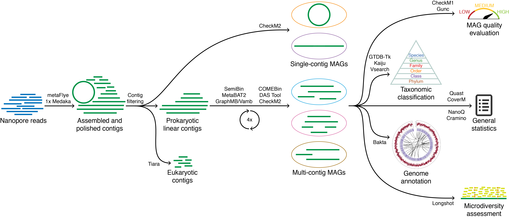

<p align="center">

</p>

Automated long-read metagenomics workflow, using either PacBio HiFi or Nanopore sequencing reads as input to generate characterized MAGs.
The mmlong2 workflow is a continuation of [mmlong](https://github.com/SorenKarst/mmlong).

**Note:** Multiple large-scale databases are utilized by mmlong2 for genome bin analysis. If you are only interested in getting the MAGs, check out [mmlong2-lite](https://github.com/Serka-M/mmlong2-lite).
<br/>
<br/>

**Overview of mmlong2 workflow in Nanopore-only mode:**


**Quick-start (AAU bioserver users):**
```
export PATH=$PATH:/projects/microflora_danica/mmlong2
mmlong2 -h
```
<br/>

**Usage example for hybrid (Nanopore/Illumina) mode:**
```
mmlong2 -np [Nanopore_reads.fastq] -il [Illumina_reads.fastq] -t [Threads] -o [Output_dir]
```
<br/>

**Full usage:**
```
MAIN INPUTS:
-np     --nanopore_reads        Path to Nanopore reads (default: none)
-pb     --pacbio_reads          Path to PacBio HiFi reads (default: none)
-o      --output_dir            Output directory name (default: mmlong2)
-p      --processes             Number of processes/multi-threading (default: 3)
-cov    --coverage              CSV dataframe for differential coverage binning (e.g. NP/PB/IL,/path/to/reads.fastq)
-run    --run_until             Run pipeline until a specified stage completes 
				(e.g. assembly polishing binning taxonomy annotation variants)

ADDITIONAL INPUTS:
-tmp    --temporary_dir         Directory for temporary files (default: none)
-med1   --medaka_model_polish   Medaka polishing model (default: r1041_e82_400bps_sup_g615)
-sem    --semibin_model         Binning model for SemiBin (default: global)
-fmo    --flye_min_ovlp         Minimum overlap between reads used by Flye assembler (default: auto)
-fmc    --flye_min_cov          Minimum initial contig coverage used by Flye assembler (default: 3)
-mlc    --min_len_contig        Minimum assembly contig length (default: 3000)
-mlb    --min_len_bin           Minimum genomic bin size (default: 250000)
-slv    --silva                 Silva database to use (default: none)
-mds    --midas                 Midas database to use (default: none)
-gnc    --gunc                  Gunc database to use (default: none)
-bkt    --bakta                 Bakta database to use (default: none)
-kj     --kaiju                 Kaiju database to use (default: none)
-gdb    --gtdb                  GTDB-tk database to use (default: none)
-x1     --extra_inputs1         Extra inputs for the MAG production part of the Snakemake workflow (default: none)
-x2     --extra_inputs2         Extra inputs for the MAG processing part of the Snakemake workflow (default: none)

MISCELLANEOUS INPUTS:
-h      --help                  Print help information
-v      --version               Print workflow version number
```
<br/>

**Overview of result files:**
* `assembly.fasta` - assembled and polished metagenome
* `rRNA.fa` - rRNA sequences, recovered from the polished metagenome
* `rRNA_16S.fa` - 16S rRNA sequences, recovered from the polished metagenome
* `<name>_contigs.tsv` - dataframe for metagenome contig metrics
* `<name>_bins.tsv` - dataframe for automated binning results
* `<name>_general.tsv` - workflow results, summarized into a single row
* `dependencies.csv`- list of dependencies used and their versions
* `bins` - directory for metagenome assembled genomes
* `bakta` - directory, containing bin annotation results from [bakta](https://github.com/oschwengers/bakta)
<br/>

**Additional documentation:**
* [Dataframe description](msc/mmlong2-dfs.md)
* [Dependency list](msc/mmlong2-dep.md)
<br/>

**Comments:**
* The workflow assumes that the input reads have been quality-filtered and adapter/barcode sequences have been trimmed off.
* The workflow is long-read-based and requires either Nanopore or PacBio HiFi reads. It doesn't feature an Illumina-only mode.
* If the workflow crashes, it can be resumed by re-running the same command. Some of the intermediary files might have to be removed for compatibility.
* It is recommended to run the workflow from a screen session. This can be achieved with e.g. `screen -R mmlong2` and then running the workflow.
<br/>

**Future improvements**<br/>
Suggestions on improving the workflow or fixing bugs are always welcome.<br/>
Please use the GitHub `Issues` section or e-mail to mase@bio.aau.dk for providing feedback.
