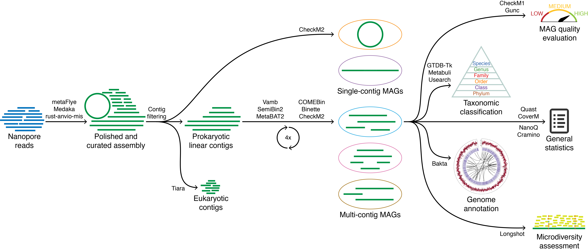

<p align="center">

</p>

Automated long-read metagenomics workflow, using either PacBio HiFi or Nanopore sequencing reads as input to generate characterized MAGs.
The mmlong2 workflow is a continuation of [mmlong](https://github.com/SorenKarst/mmlong).
<br/>

## Workflow description
### Core features
* [Snakemake](https://snakemake.readthedocs.io) workflow running dependencies from a [Singularity](https://docs.sylabs.io/guides/latest/user-guide/) container for enhanced reproducibility
* Bioinformatics tool and parameter optimizations for high complexity metagenomics samples
* Circular prokaryotic genome extraction as separate genome bins
* Eukaryotic contig removal for reduced prokaryotic genome contamination
* Differential coverage support for improved prokaryotic genome recovery
* Iterative ensemble binning strategy for improved prokaryotic genome recovery
* Genome quality classification according to [MIMAG guidelines](https://www.nature.com/articles/nbt.3893)
* Expanded prokaryotic genome quality assessment, including microdiversity approximation and chimerism checks
* Taxonomic classification at prokaryotic genome, contig and 16S rRNA levels
* Generation of analysis-ready [dataframes](msc/mmlong2-dfs.md) at genome bin and contig levels

### Schematic overview

<br/>

## Installation
### Bioconda
The recommended way of installing mmlong2 is by setting up a [Conda](https://docs.conda.io/projects/conda/en/latest/user-guide/install/linux.html) environment through [Bioconda](https://bioconda.github.io/):
```
mamba install -c bioconda mmlong2
```

### From source (Conda) 
A local Conda environment with the latest workflow code can also be created by using the following code:
```
mamba create --prefix mmlong2 -c conda-forge -c bioconda snakemake=8.2.3 singularity=3.8.6 zenodo_get pv pigz tar yq ncbi-amrfinderplus -y
mamba activate ./mmlong2 || source activate ./mmlong2
git clone https://github.com/Serka-M/mmlong2 mmlong2/repo
cp -r mmlong2/repo/src/* mmlong2/bin
chmod +x mmlong2/bin/mmlong2
mmlong2 -h 
```

### Databases and bioinformatics software
Bioinformatics tools and other software dependencies will be automatically installed when running the workflow for the first time.
By default, a pre-built [Singularity](https://docs.sylabs.io/guides/latest/user-guide/) container will be downloaded and set up, although pre-defined Conda environments can also be used by running the workflow with the `--conda_envs_only` setting.
<br/><br/>
To acquire prokaryotic genome taxonomy and annotation results, databases are necessary and can be automatically installed by running the following command:
```
mmlong2 --install_databases
```
If some of the databases are already installed, they can also be used by the workflow without downloading (e.g. `--database_gtdb` option). Alternatively, a guide for [manual](msc/mmlong2-db.md) database installation is also provided.
<br/><br/>

## Running mmlong2
### Usage example
```
mmlong2-lite -np nanopore_reads.fastq.gz -o output_dir -p 100
```

### Full usage
```
MAIN INPUTS:
-np     --nanopore_reads        Path to Nanopore reads
-pb     --pacbio_reads          Path to PacBio HiFi reads
-o      --output_dir            Output directory name (default: mmlong2)
-p      --processes             Number of processes/multi-threading (default: 3)

OPTIONAL SETTINGS:
-db     --install_databases     Install missing databases used by the workflow
-dbd    --database_dir          Output directory for database installation (default: current working directory)
-cov    --coverage              CSV dataframe for differential coverage binning (e.g. NP/PB/IL,/path/to/reads.fastq)
-run    --run_until             Run pipeline until a specified stage completes (e.g.  assembly polishing filtering singletons coverage binning taxonomy annotation extraqc stats)
-tmp    --temporary_dir         Directory for temporary files (default: current working directory)
-dbg    --use_metamdbg          Use metaMDBG for assembly of PacBio reads (default: use metaFlye)
-med    --medaka_model          Medaka polishing model (default: r1041_e82_400bps_sup_v5.0.0)
-mo     --medaka_off            Do not run Medaka polishing with Nanopore assemblies (default: use Medaka)
-vmb    --use_vamb              Use VAMB for binning (default: use GraphMB)
-sem    --semibin_model         Binning model for SemiBin (default: global)
-mlc    --min_len_contig        Minimum assembly contig length (default: 3000)
-mlb    --min_len_bin           Minimum genomic bin size (default: 250000)
-rna    --database_rrna         16S rRNA database to use
-gunc   --database_gunc         Gunc database to use
-bkt    --database_bakta        Bakta database to use
-kj     --database_kaiju        Kaiju database to use
-gtdb   --database_gtdb         GTDB-tk database to use
-h      --help                  Print help information
-v      --version               Print workflow version number

ADVANCED SETTINGS:
-fmo    --flye_min_ovlp         Minimum overlap between reads used by Flye assembler (default: auto)
-fmc    --flye_min_cov          Minimum initial contig coverage used by Flye assembler (default: 3)
-env    --conda_envs_only       Use conda environments instead of container (default: use container)
-n      --dryrun                Print summary of jobs for the Snakemake workflow
-t      --touch                 Touch Snakemake output files
-r1     --rule1                 Run specified Snakemake rule for the MAG production part of the workflow
-r2     --rule2                 Run specified Snakemake rule for the MAG processing part of the workflow
-x1     --extra_inputs1         Extra inputs for the MAG production part of the Snakemake workflow
-x2     --extra_inputs2         Extra inputs for the MAG processing part of the Snakemake workflow
-xb     --extra_inputs_bakta    Extra inputs (comma-separated) for MAG annotation using Bakta
```

### Using differential coverage binning
To perform genome recovery with differential coverage, prepare a 2-column comma-separated dataframe, indicating the additional read datatype (`NP` for Nanopore, `PB` for PacBio, `IL` for short reads) and read file location.<br/>
Dataframe example:
```
PB,/path/to/your/reads/file1.fastq
NP,/path/to/your/reads/file2.fastq
IL,/path/to/your/reads/file3.fastq.gz
```
The prepared dataframe can be provided to the workflow through the `-cov` option.

### Overview of workflow results
* `<output_name>_assembly.fasta` - assembled and polished metagenome
* `<output_name>_16S.fa` - 16S rRNA sequences, recovered from the polished metagenome
* `<output_name>_bins.tsv` - per-bin results [dataframe](msc/mmlong2-dfs.md#output_name_binstsv)
* `<output_name>_contigs.tsv` - per-contig results [dataframe](msc/mmlong2-dfs.md#output_name_contigstsv)
* `<output_name>_general.tsv` - workflow result summary as a single row [dataframe](msc/mmlong2-dfs.md#output_name_generaltsv)
* `dependencies.csv`- list of dependencies used and their versions
* `bins` - directory for metagenome assembled genomes
* `bakta` - directory, containing bin annotation results from [bakta](https://github.com/oschwengers/bakta)
<br/>

## Additional documentation
* [Dataframe descriptions](msc/mmlong2-dfs.md)
* [Dependency list](msc/mmlong2-dep.md)
* [Database setup](msc/mmlong2-db.md)

*Comments:*
* The workflow assumes that the input reads have been quality-filtered and adapter/barcode sequences have been trimmed off.
* The workflow is long-read-based and requires either Nanopore or PacBio HiFi reads. It doesn't feature an Illumina-only mode.
* If the workflow crashes, it can be resumed by re-running the same command. Some of the intermediary files might have to be removed for compatibility.
* It is recommended to run the workflow from a screen session. This can be achieved with e.g. `screen -R mmlong2` and then running the workflow.
* Multiple large-scale databases are utilized by mmlong2 for genome bin analysis. If you are only interested in getting the MAGs, check out [mmlong2-lite](https://github.com/Serka-M/mmlong2-lite).
<br/>

## Future improvements
Suggestions on improving the workflow or fixing bugs are always welcome.<br/>
Please use the GitHub `Issues` section or e-mail to mase@bio.aau.dk for providing feedback.

[//]: # (Written by Mantas Sereika)
